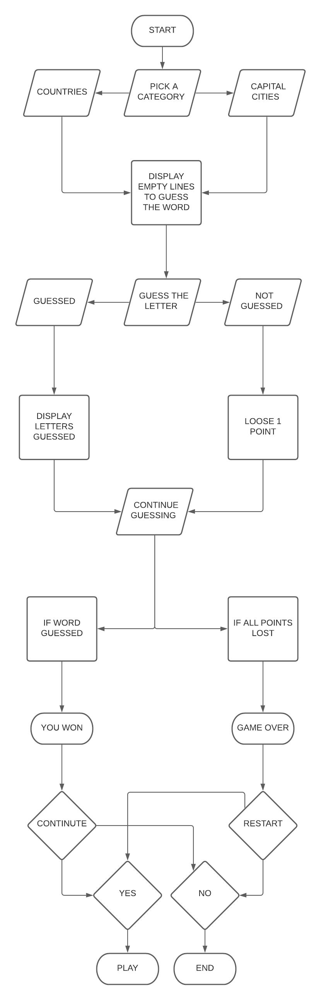
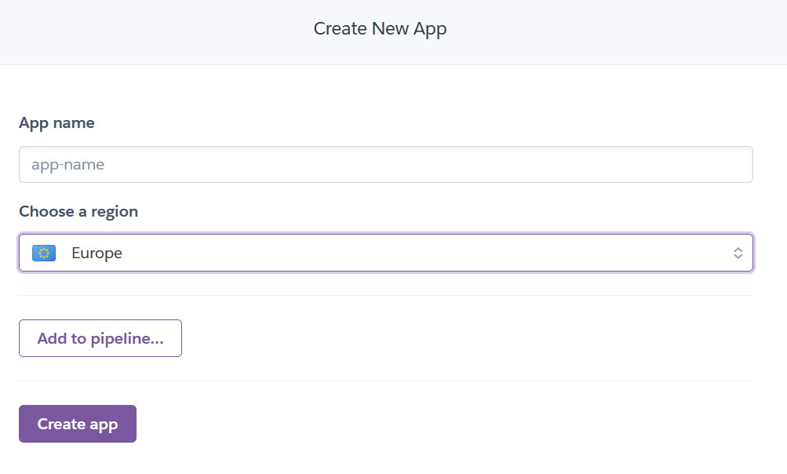
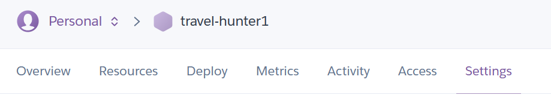
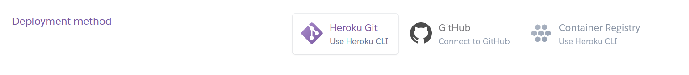
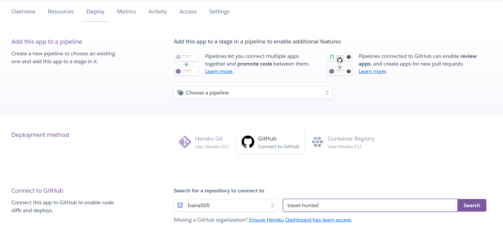
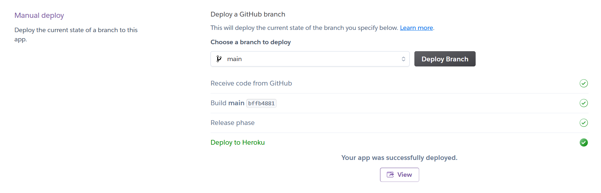
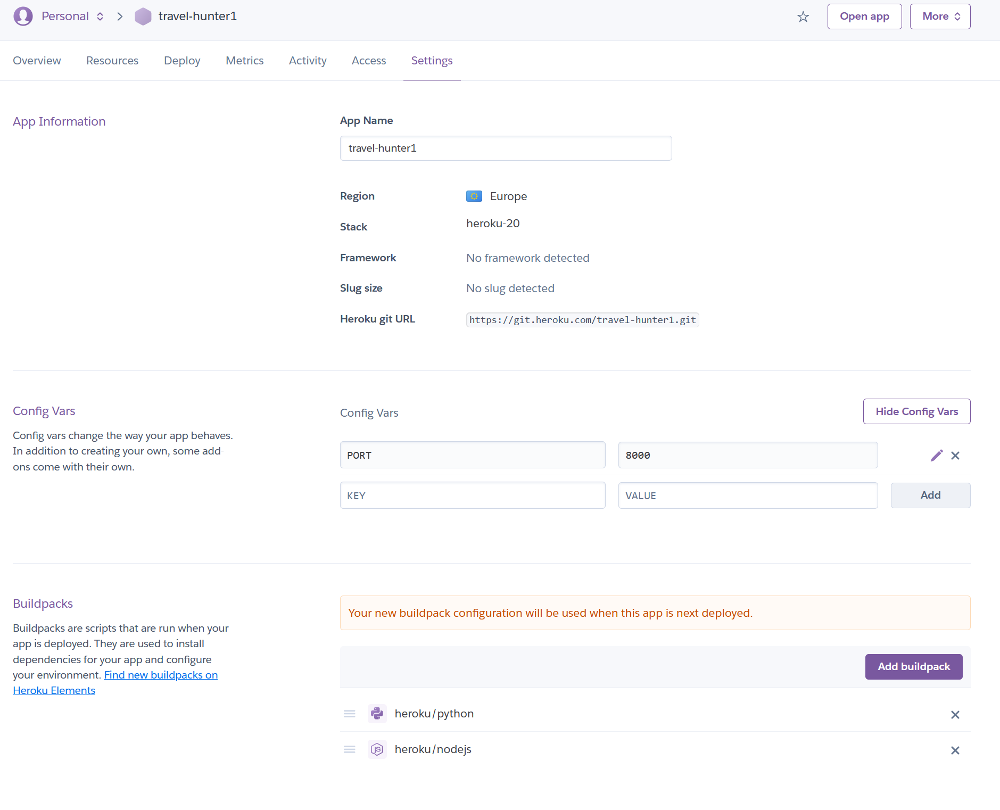

# Travel Hunter
Travel Hunter is a website for anyone who likes guessing games like hangman.
You can access the website [here](https://travel-hunter1.herokuapp.com/).

## Features
- Greeting  
    - "Good day player" greets the user.

- Instructions
     - "Try to guess the hidden word to get tto your destination"

- Choose category
     - User can choose between two categories Cities and Countries.

# User Experience

## Goals

### Visitor goals

The target audience are kids and adults who like hidden words type of games : 

- To easily understand instructions of the game.
- To learn new city and country names.
- To have fun.

### User Goals

As a user I would like to:

- Have more categories to choose from.
- Be able to play against another human player.
- Be able to use game on different devices.
- Be able to play game again without reloading the page.

## Design Choices

Font choices

I have decided to use 

 Indie Flower font-family
    ![indie flower font family]
 Lato font-family
    ![lato font family]

Icons

- Social Media Icons [Github](https://www.github.com/) and [LinkedIn](https://ie.linkedin.com) are centered and added to the bottom of the page where user will be able to find further Information about me. 

## Color scheme and styling

 - I have decided to use 4 color combination scheme for the page: pink, red, black and white.
 - Background color of the page is pink. Black color is used for headings and black and white combination for the piano keyboard.
 - Red is used as a notification that the key has been pressed.
 - Buttons and modal are styled with further colors and opacity of the black color.
Note colors below : 

## Flowchart
Flowchart is created with [Lucidchart](https://www.lucidchart.com/pages/) during the Scope Plane part of the design and planning process for this project.

## Testings

### Validator testing and browser compatibility
- I have tested Python code with - [PEP8 validator](http://pep8online.com/), first testing showed ......

- Second Python code validation showed .......

- Final PEP8 code validation showed ......

### Browser compatibility
- I can confirm that I have tested website on four different Web Browsers and that the page if compatible:

Landing page [Google Chrome](https://www.google.com/chrome/)

Modal "How to play ?" [Mozilla Firefox](https://www.mozilla.org/en-US/firefox/new/)

Modal "Choose your song" [Brave](https://brave.com/)

### Accessibility
- I have confirmed that the Website is accessible by inspecting it in Lighthouse on the [Google Chrome](https://www.google.com/) Dev tools.
- Also, color contrast between pink and black color showed good at 13.65.
    
Result for desktop 
 - Performance for the desktop version 

Result for mobile devices
- Performance for mobile devices 

### Bugs

#### Solved
- blabla.

#### Unsolved bugs
blabla

## Deployment

Just cloning function under local.
The site was deployed to Github pages using following steps: 
   - Login to Github and go into repository Ivana505/travel-hunter
   - Click on settings and scroll down to Pages section on the page
   - Under the source heading select the master branch option and click save
   - The project has now been deployed and wait for approximate 10 minutes for the link to become active
   - Refresh the page and click on the link to view the live site
  

The site was deployed to [Heroku](https://heroku.com/) pages using following steps: 
   - Sign up or Login to Heroku 
   - Click on the "NEW APPLICATION"
   - Under the source heading select the master branch option and click save
   - The project has now been deployed and wait for approximate 10 minutes for the link to become active
   - Refresh the page and click on the link to view the live site

The live site can be previewed [here](https://travel-hunter1.herokuapp.com/)

### Local Deployment

In order to make a local copy of this repository, you can type the following into your IDE Terminal:

- `git clone hhttps://github.com/Ivana505/travel-hunter.git` 

Alternatively, if using Gitpod, you can [click here](https://gitpod.io/#https://github.com/Ivana505/travel-hunter) to create a new workspace under your account.
  
  # Languages and technologies used
- [Python](https://www.python.org/)
- [Github](https://github.com/)
- [Git](https://git-scm.com/)

## Credits and Acknowledgements

- Social Media sources:
- [YouTube channel ](https://www.youtube.com/watch?v=F3odgpghXzY) for
- [YouTube channel ](https://www.youtube.com/watch?v=vjco5yKZpU8) for 

  Other sources
  - [W3 Schools](https://www.w3schools.com/howto/howto_css_modals.asp) helped me with creating modal box.
  - [Stack Overflow](https://stackoverflow.com/questions/50229293/get-id-of-clicked-element-vanilla-js) to get ID of clicked element in JavaScript.
  - [Am I reponsive](http://ami.responsivedesign.is/) to show responsiveness of the Website.
  - [Codepen](https://codepen.io/tag/piano)

  I want to say thank you to my Mentor Tim for the guidance and tutor support.

### Content
 - Content was created intentionally for the purpose of this project and this Website. Credits go to the creator of the Website.

