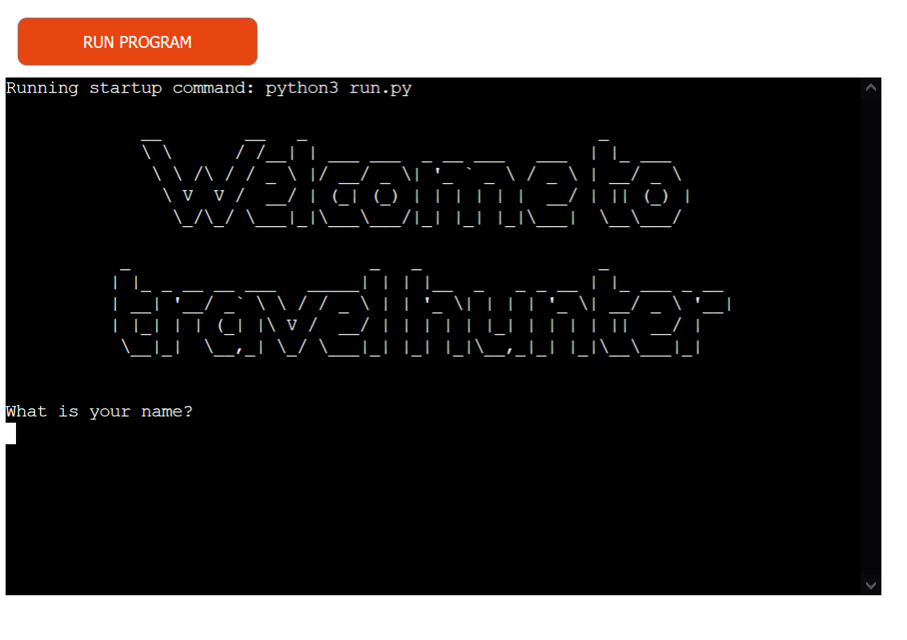
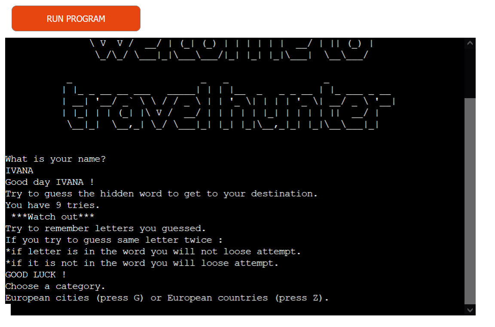
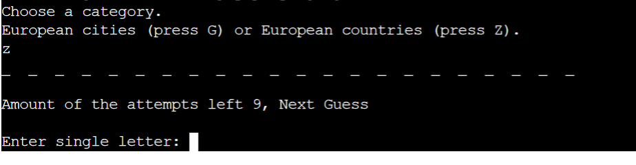
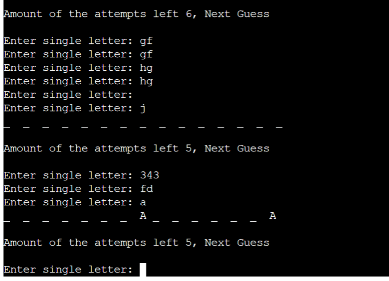
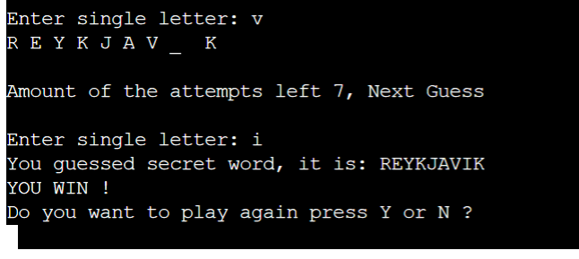
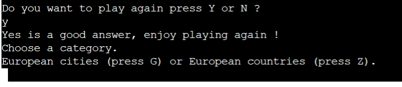
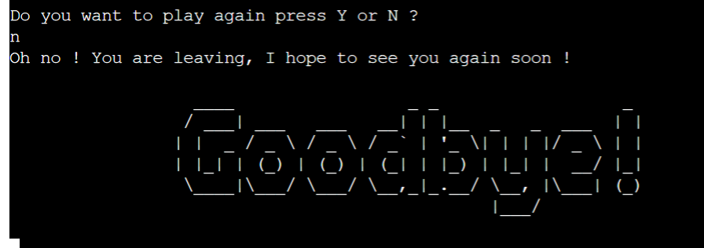

# Travel Hunter
Travel Hunter is a game for anyone who likes guessing games like hangman.
In this game you need to guess a hidden word to get to your destination as it is travel related.

You need to guess hidden European City or Country.

To start playing, please click [here](https://travel-hunter1.herokuapp.com/).

## How to play
  - Hangman game is a logic guessing game. You can read more about it on [Wikipedia](https://en.wikipedia.org/wiki/Hangman_(game)).
    - In this version player enters their name, after the name has been entered instructions show.
    - Player then chooses a category and tries to guess a hidden word showing with underscores.
    - Player needs to remember letters tried.
    - If player tries to guess same letter twice: 
    1. If letter is in the word player will not loose attempt.
    2. If letter is not in the word player will loose attempt.
    - If the word is guessed, player wins, if not player lost.

## Features
- Greeting and "What is your name?"
    - "Welcome to Travel Hunter" greets the user.
    - User can add real or fictional name for the game.

- Instructions
     - After player adds the name instructions are displayed.
     - Gives full insight of how the game is played and what you need to do to win.

- Choose a category
     - User can choose between two game categories Cities and Countries.

- Guessing
     - Hidden word shows with underscores. 
     - Player needs to input single letter. If any other input is added numbers or more letters at the same time message will appear "Enter single letter"
     - If guessed or not, word will be revealed and a question will appear asking player to play again yes or no.
     - If yes is selected player is asked to choose category.
     - If no is selected message "Goodbye" appears and game ends.

# User Experience

## Goals

### Visitor goals

The target audience are kids and adults who like hidden words type of games : 

- To easily understand instructions of the game.
- To learn new city and country names.
- To have fun.

### User Goals

As a user I would like to:

- Have more categories to choose from.
- Be able to play against another human player or machine.
- Be able to use game on different devices.
- Be able to see letters already used. 

## Flowchart
Flowchart is created with [Lucidchart](https://www.lucidchart.com/pages/) during the Scope Plane part of the design and planning process for this project.

## Testings

To view all testing documentation please refer to [TESTING.md](TESTING.md)

### Local Deployment

In order to make a local copy of this repository, you can type the following into your IDE Terminal:

- `git clone https://github.com/Ivana505/travel-hunter.git` 

Alternatively, if using Gitpod, you can click below to create your own workspace using this repository.

The site was deployed to [Heroku](https://heroku.com/) pages using following steps: 
   - Sign up or Login to Heroku 
   - Click on the "NEW APPLICATION" and create an App name and choose your region
   - Click on "Deploy" and choose your deployment method
   - If you are connecting with Github choose your main branch and find your repository
   - Add config vars PORT = 8000 and buildpacks python and nodejs
   - Click on deploy manually or automatically
   - The project has now been deployed
   - When deployed click on view
   - If you click on settings on the main menu bar you will find your Heroku git URL

    To install the required packages for this application, type the following: pip3 install -r requirements.txt

import pyfiglet
import random
import sys
   

The live site can be previewed [here](https://travel-hunter1.herokuapp.com/).

  # Languages and technologies used
- [Python](https://www.python.org/) - used for core programming language and logic
- [Github](https://github.com/) - used for securely storing the code online
- [Git](https://git-scm.com/) - used for version control
- [Gitpod](https://www.gitpod.io/) - used for online cloud IDE and development
- [Heroku](https://heroku.com/) - platform used to deploy game to cloud online

## Credits and Acknowledgements

  Social Media sources:
- [YouTube channel Kylie Ying](https://www.youtube.com/watch?v=cJJTnI22IF8)
- [YouTube channel NeuralNine](https://www.youtube.com/watch?v=5x6iAKdJB6U)
- [YouTube channel Learn Learn Scratch Tutorials](https://www.youtube.com/watch?v=U1aUteSg2a4)
- [YouTube channel SIMPLECODE](https://www.youtube.com/watch?v=q9nSmJu0cxI)

  Other sources
  - [Lucidchart](https://www.lucidchart.com/pages/) for creating a flowchart for the project.
  - [PEP8 online](http://pep8online.com/) for checking code requirements.
  - [Stack Overflow](https://stackoverflow.com/questions/4394145/picking-a-random-word-from-a-list-in-python) for picking random word from a list.
  - [Stack Overflow](https://stackoverflow.com/questions/58467922/how-can-i-show-the-guessed-letters-of-a-word-guesser-in-order-python) for guessing logic.
  - [Stack Overflow](https://stackoverflow.com/questions/39199188/how-do-i-only-allow-letters-when-asking-for-a-name-in-python/39199261) for more Information about isalpha() function.
  - [Stack Overflow](https://stackoverflow.com/questions/2070684/how-can-i-make-my-python-code-stay-under-80-characters-a-line) for explanation how connect lines longer then 80 characters.
  - [Invent with python](https://inventwithpython.com/invent4thed/chapter8.html) for logic for asking player to enter single letter.
  - [Icodemag](https://icodemag.com/creating-a-simple-hangman-game-in-python/) for the final reveal of the hidden word.
  - [NEWBEDEV](https://newbedev.com/how-to-ask-a-yes-or-no-question-in-python-code-example) for yes no questions and decision making.
  - [Hashbangcode](https://www.hashbangcode.com/article/stopping-code-execution-python) to stop the code and finish the game.
  - [Code Grepper](https://www.codegrepper.com/code-examples/whatever/No+module+named+%27pyfiglet%27) instructions how to install pyfiglet.
  - [Pythong for beginners](https://www.pythonforbeginners.com/random/how-to-use-the-random-module-in-python) for more Information about import random module.

I want to say thank you to my Mentor Tim for the guidance, tutor support and special thanks to the Code Institute Slack community.

### Content
 - Content was created intentionally for the purpose of this project and this Website. Credits go to the creator of the Website.

