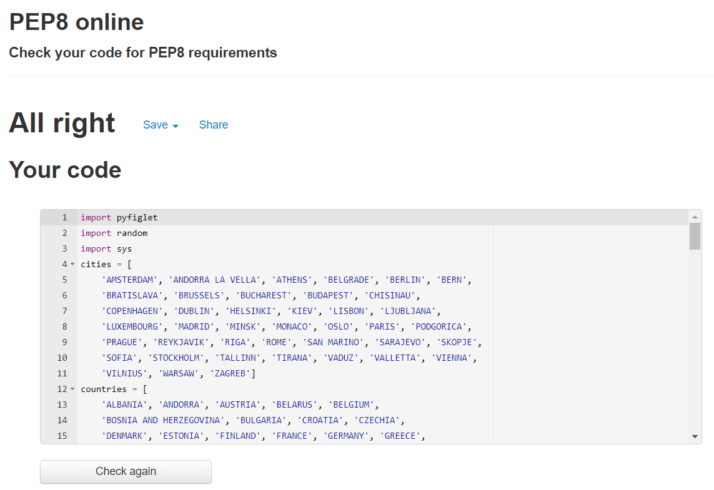
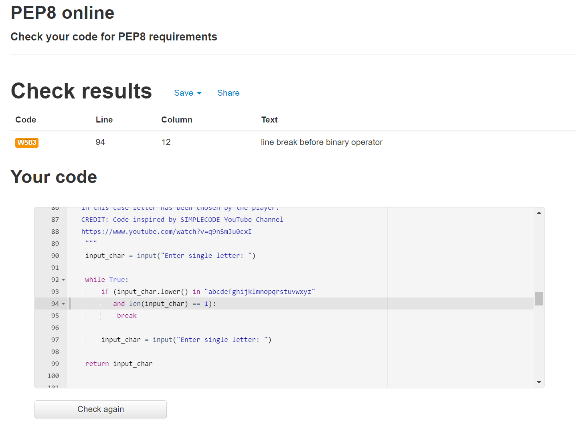
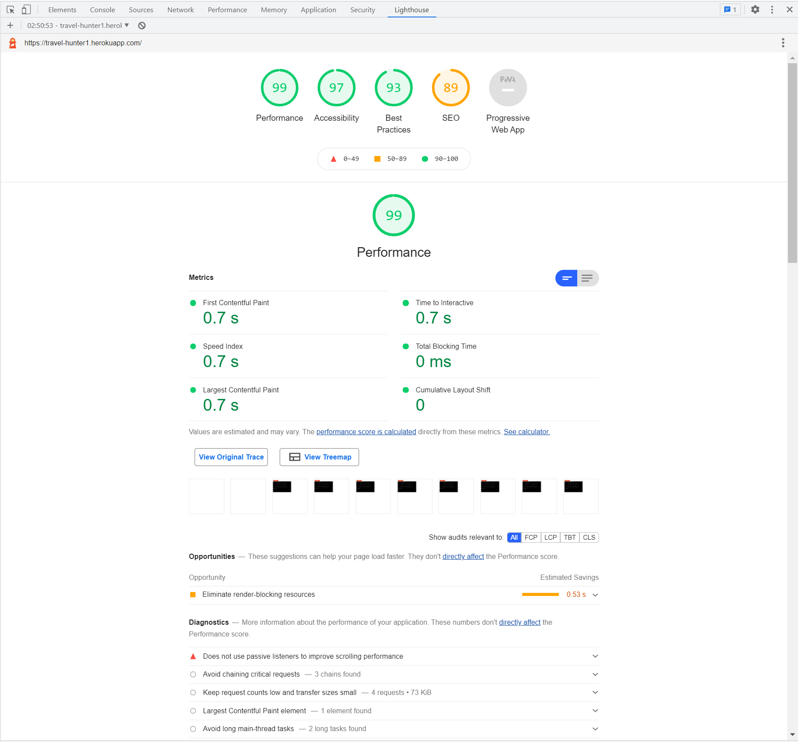
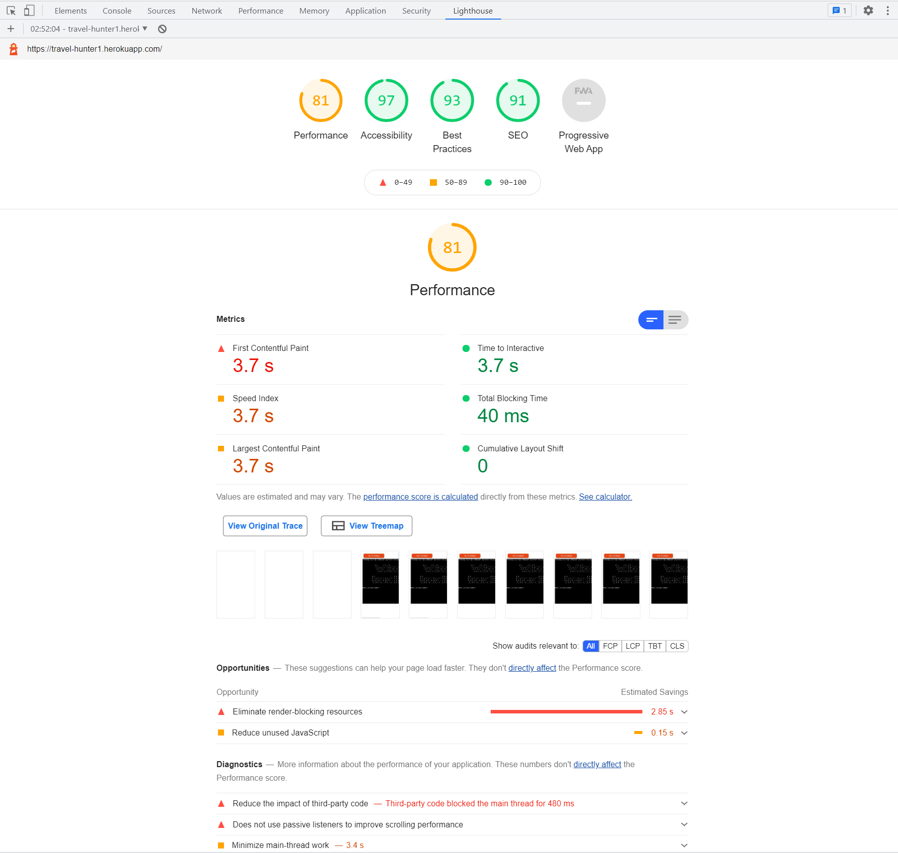

# TESTING 

Return to the [README.md](REAMDE.md)

## Validator testing and browser compatibility
- I have tested Python code with - [PEP8 validator](http://pep8online.com/), first testing showed no errors

- Second Python code validation showed line break before binary operator.

## Accessibility
- I have confirmed that the Website is accessible by inspecting it in Lighthouse on the [Google Chrome](https://www.google.com/) Dev tools.
    
Result for desktop 
 - Performance for the desktop version 

Result for mobile devices
- Performance for mobile devices 

## Bugs

### Solved
- blabla.

### Unsolved bugs
blabla

