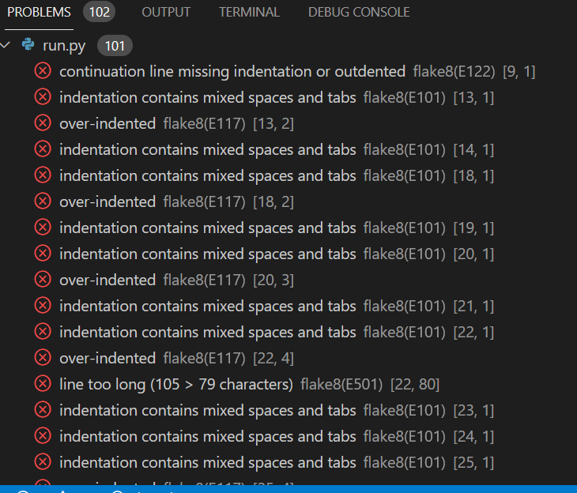
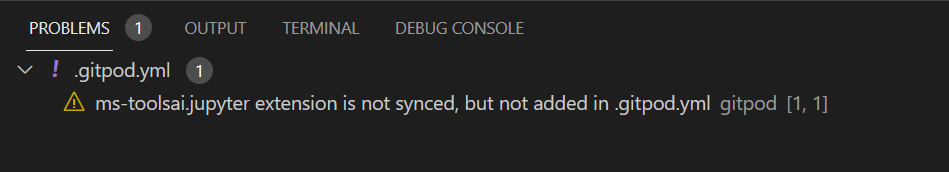

# TESTING 

Return to the [README.md](REAMDE.md)

## Validator testing and browser compatibility
- I have tested Python code with - [PEP8 validator](http://pep8online.com/), first testing showed no errors.

- Second Python code validation showed line break before binary operator error which is mentioned under Unsolved bugs category.

## Accessibility
- I have confirmed that the Website is accessible by inspecting it in Lighthouse on the [Google Chrome](https://www.google.com/chrome/?brand=FKPE&gclid=EAIaIQobChMIqOPWwuu69AIVFeDtCh1CEgKGEAAYASAAEgKvwvD_BwE&gclsrc=aw.ds) Dev tools.
    
Result for desktop 
 - Performance for the desktop version 

Result for mobile devices
- Performance for mobile devices 

## Bugs

### Solved
- I had 102 bugs on [Gitpod](https://www.gitpod.io/) and 101 have been fixed. Most of them were indentation bugs and lines of code too long.

### Unsolved bugs
- Unsolved problem which relates to ms-toolsai.jupyter extension not bein synched and not added in .gitpod.yml. I have checked Slack community and this is known issue which we can ignore.
- This is also part of the repository cloned for the project that should not be touched.

- Second Python code validation showed line break before binary operator error. 
- Code was too long for one line so I followed [Stack Overflow](https://stackoverflow.com/questions/15435811/what-is-pep8s-e128-continuation-line-under-indented-for-visual-indent) guidelines to resolve it but then this error appeared after second validation with [PEP8 validator](http://pep8online.com/).

 - As per [Python](https://www.python.org/dev/peps/pep-0008/#should-a-line-break-before-or-after-a-binary-operator) this is styling issue.
 

